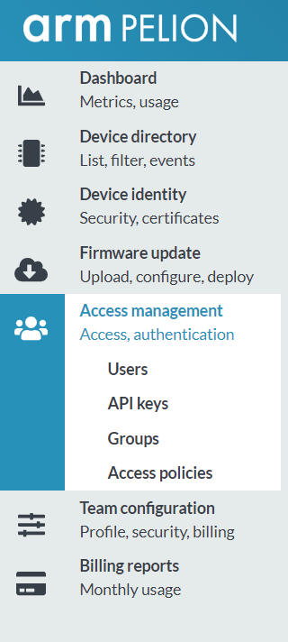
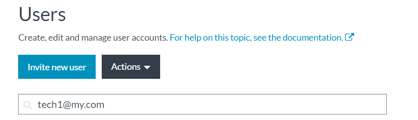
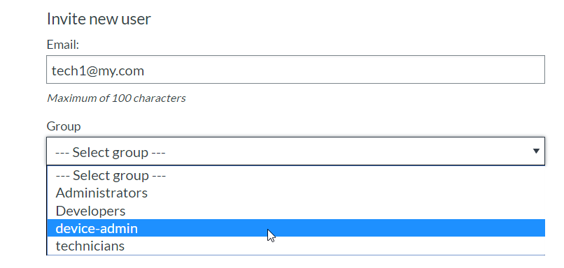
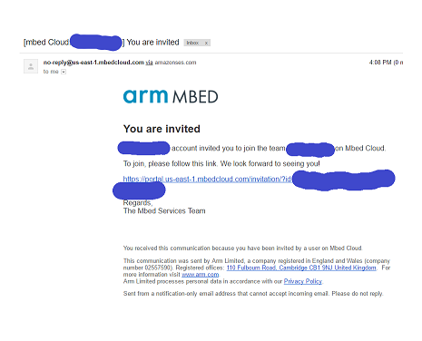
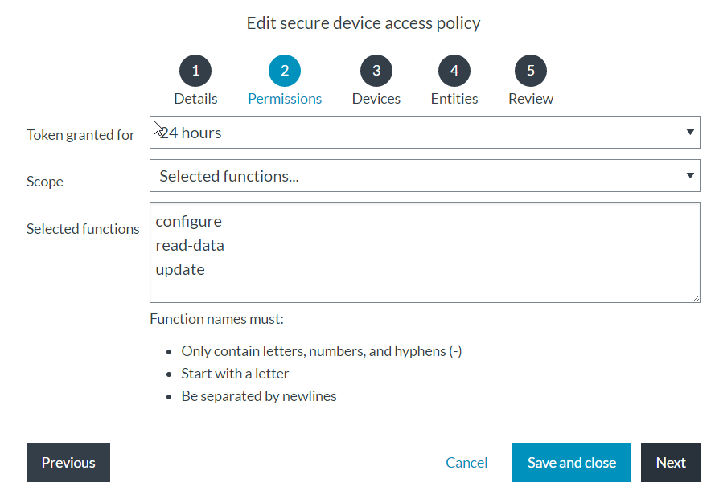

# Secure Device Access (SDA) Demo Settings

## Demo Account Settings
You must use your Pelion Device Management account to run the demo application. Setting up the account means that you will have a trust anchor (i.e. public key) that you can compile with your Mbed demo application.
Note that at the moment Secure Device Access is a feature that is **not available by default** to Device Management accounts, and needs to be requested.

## Account Setup in Portal

Request an account from the Device Management support team, if you do not have one yet. Also make sure that the Secure Device Access feature is **enabled** for you. You will need to be Administrator in this account to set up the demo (for operations like adding users).

How can I tell?<BR/>


After login **click** the _"Access Management"_ link at the left pane (see in the image above). On an enabled account, there is _"Access policies"_ link available. In case you do not see it, you need to request to enable of Secure Device Access in your account (Account Administrator can do that through the admin portal).

In the document [running_the_demo.md](running_the_demo.md) see the demo scenario to learn more about the various entities.


## Creating user groups
1. Click on 'Groups' -> Create new group
2. Create a group called 'device-admin' - users in this group will be allowed all operations on the device
3. Create another group called 'technicians' - users in this group will be allowed only limited operations on the device.

## Creating the users
You will need to create two users to represent the two demo technicians (here called _tech1_ and _tech2_). The users should have real mailboxes (your organization emails should be just fine) and should be invited into the account.

1. Go to _Users_ and invite user using his or her email:
 <BR/><BR/>
2. Click 'Invite', you will be required to enter your password.
3. In the next screen assign a group to the user - in tech1 case, assign to 'device-admin' you created<BR/>


4. The user should go to his email and **click** the provided link to finish enrolling into the account (need to set a password!). Note that the password for the technician should be used by each technician using the demo application to login. The email should look like the following:<BR/>
<BR/><BR/><BR/>
5. Repeat the process again to add tech2 to 'technicians' group

## Creating Demo policies

We will give example on how to create SDA policies. When the proxy (Android app) requesting an access token, these policies are checked and only if there is a policy matching to the parameters of the request a positive response (i.e. an access token) is returned. This means that to show in the demo you succeed in receiving a token, you must define policies properly.


### Technician #2 policy - read-data only

See input suggestions in _italics_:

1. Click _Access policies_ at the left pane.
2. Click _New access policy_ button
3. Example name could be: _SDA Demo - group="technicians" ep="Mbed1"_
4. Description can be: _Allowing technicians 'read-data' operations on device with endpoint-name 'Mbed1'_
5. Click next
6. Token Granted for: 24 hours
7. Scope: _Selected functions_
8. In the 'Selected functions' field type: _read-data_
9. Click next
10. Identify devices by: _Endpoint name_
11. Values: _Mbed1_
12. Click next
13. In the users\groups - select _technicians_ group
14. Click next to review the policy
15. Click _Activate_ to save and activate the policy
16. You should see the policy in the policy list of your account now with the status 'ACTIVE'


### Admin Technician (tech1@my.com) - allow all operation
1. Click New access policy button
2. Example name could be: _SDA Demo - group="device admin" ep="Mbed1"_
3. Description can be: Allowing device-admin group all operations device with endpoint-name 'Mbed1'
4. Click next
5. Token Granted for: 24 hours
6. Scope: Selected functions
7. In the 'Selected functions' field type: _read-data update configure_ separated by newlines.<BR/> <BR/><BR/>
8. Click next
9. Identify devices by: Endpoint name
10. Values: Mbed1
11. Click next
12. In the users\groups - select technicians group
13. Click next to review the policy
14. Click Activate to save and activate the policy
15. You should see the policy in the policy list of your account now with the status 'ACTIVE'

## Setting up the client binaries

### Generating a developer certificate
1.	Log in to the portal with your credentials.
2.	Navigate to Device identity > Certificates.
3.	Click Actions > Create a developer certificate.
4.	Add a name and an optional description for the certificate, and click _Create certificate_.
5.	Click _Download Developer C file_. The file mbed_cloud_dev_credentials.c downloads. In the downloaded C file note the device endpoint name in the following line:
```
const char MBED_CLOUD_DEV_BOOTSTRAP_ENDPOINT_NAME[] = "XXXXXXXXXXXXXXXXXXXXXXXXXXXXXXXX";
```
You will need to use this name in the demo Android application as the device to get credentials on.

**Important**: When running the demo, **only the first 15 characters will be shown on the device display due to display limitations**. The actual device endpoint name is the **full value** above, this is critical for any scenario that uses the endpoint name!
### Using your trust anchor

1. Click Device Identity -> Trust Anchor to see the trust Anchor, copy it and use it in demo client build.

### Build Client
See instructions for building client demo at: [secure-device-access-client-example repository](https://github.com/ARMmbed/secure-device-access-client-example-sources-internal/blob/master/README.md)


## Setting up the Android Package Kit (APK)

The Android application resides in the `arm-sda-android` directory. See the top README file for instruction on how to build the application.

### Changes required before build
To perform login your application needs to know the base URL to connect to Device Management and your account ID.

Edit  _arm-sda-android/app/src/main/res/values/properties.xml_
```xml_
<resources>
    <string name="env_url">https://api.us-east-1.mbedcloud.com</string>
    <string name="account_id">Your account ID goes here</string>
	<string name="device_ep">Paste your device endpoint name here from developer certificate</string>
</resources>
```
1. **env\_url** -  The URL is the Device Management base URL (should change only if you have Device Management on-premises )
2. **account_id** - Your account ID is visible when you click account settings in Portal. Contact Arm support if you do not have it.
3. **device_ep** - Instead of 'Mbed1' you should put here for convenience of the Demo your endpoint name from the Developer Certificate you installed in the device, thus it will be suggested as default by the app and remove a need to type it in manually. You can also use tools like adb in the app to later on supply long names to the application UX.

Now you can Build the apk according the README instructions.
