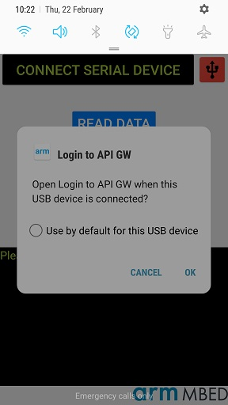
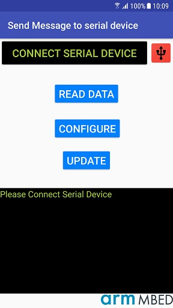
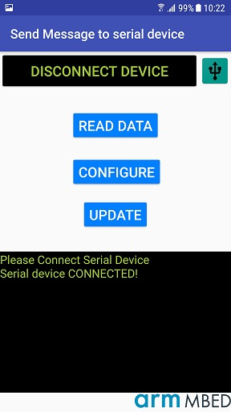
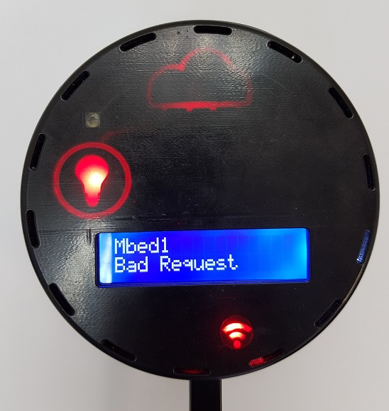
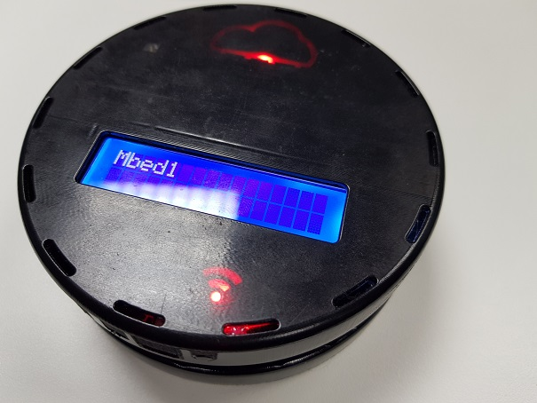
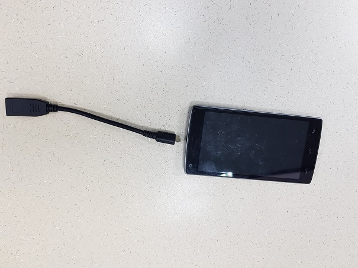
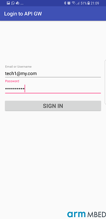
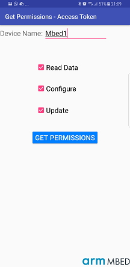
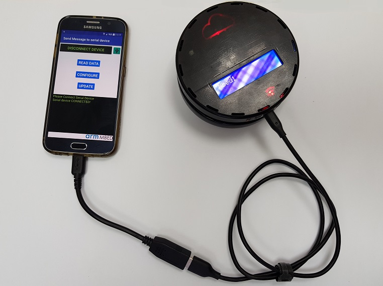

# Secure Device Access - Running the Demo
Secure Device Access Demo is demonstrating the usage of an android app (AKA 'proxy') to perform operation in a secure manner on an Mbed device. This document will elaborate how to perform this Demo using an Mbed Cloud Account, Android device and an Mbed Sales Demo device.

All the images referred here are in the appendix.
In order to run the demo you will need:

* Account in Mbed Cloud with secure device access feature turned on

* Demo APK built with your account id and pointing to the location of your Secure Device Access Service. Default is Mbed Cloud Production environment. Build and installation details in the secure-device-access-proxy-restricted/readme.md file
* Client demo app with the Trust Anchor matching to the one you use in your Mbed Cloud account. See readme in secure-device-access-client-restricted/readme.md file
* Android phone with Android 4.0.4 and above and network capabilities
* Sales Demo device (See [image-1](#image-1) in the appendix)
* Usb cable from PC to Android
* OTG Usb cable from usb to android (the phone charging the device in our connection mode)

# Running The demo
Setting up Mbed Cloud Account for this Demo is not in the scope of this document and will be elaborated in a different document.

## Demo Participants

* **Demo Device** - our device has 3 operations available:
  * **READ DATA** - Get the environment temperature using the sensor of the device.
  * **CONFIGURE** - Setting a threshold temperature on the device, if measured temperature is higher light will go RED if lower light will go BLUE
  * **UPDATE**  - Doing a 'firmware update' like operation - require a technician to be a part of 'device admin' group.
* _**Technician 1**_ - he is part of 'device admin' group and allowed to perform all the operations on the device. He is a user in our Mbed Cloud account (not account administrator!), For example let's say his credentials are (user/password): **tech1@my.com/tech1.pass**
* _**Technician 2**_ - he is part of 'technicians' group and only allowed to perform "read only" operations on the device. He is as well, a user in our Mbed Cloud account (not account administrator!), For example let's say his credentials are (user/password): **tech2@my.com/tech2.pass**

**Note: In your account, Mbed Cloud user passwords should be strong!!**

Generic Flow in SDA:
To perform an operation on the device a user must always:
1. login to Mbed Cloud Account
2. Request Access Token for an operation and a Device (step 1-2 require internet connection)
3. Connect to the device and ask it to perform an operation (the connection is physical through USB - no need for internet). See Image 5 below to see how to connect the serial over USB using USB and OTG cables.

### Scenario 1

**Description**

Technician 1 requests permission to all the actions

1. In the login screen the technician types in his credentials (See Image 3)
2. After successful login, use default device name _'Mbed1'_ and check all the checkboxes to request permission to all the operations and click the "Get Permissions" button, look for the successful notification. (See Image 4). _At this point, you have an access token, and the phone can be disconnected from the internet. The technician is now going to the disconnected environment where the IOT device is._

3. Turn on the demo device and wait for the device name to appear on the screen.
4. Connect micro usb to USB type B cable to the IOT Device
5. Connect the USB type B of the OTG cable to the usb cable that was connected to the Device
6. Connect the micro USB side of the OTG to the Android phone (in case the OTG is connected the other way around, you will get 'unrecognized device' notification ).
7. The Android will prompt you:
  * Default application to run when usb is connected - **Click Cancel!!** 
  * Ask permission to connect USB - **Allow this!**  
8. Click the _'Connect Serial Device'_ button and see the connection indicator turns green in the app.
 
9. Performing Actions: All good path, therefore expect green 'Access Granted' notification in the app
  * Click the _READ DATA_ button ... See result on the Device - temperature read
  * Click _CONFIGUE_ -> set the temp threshold and send to the device, see the action performed
  * Click _UPDATE_ -> See animation on device screen

### Scenario 2

**Description**

Technician 1 requests permission a single actions, but would like to perform another

1. In the login screen the technician types in his credentials (See Image 3)
2. After successful login, use default device name _'Mbed1'_ and check only the **read data** checkbox and click the "Get Permissions" button, look for the successful notification.
3. Since the device is on, follow **steps 4-8 of Scenario 1** to connect the phone to the IOT device via serial over USB.
4. Click the **read data** operation button and expect positive response
5. Click any other operation and expect **ACCESS DENIED** in the app and **Bad Request** from the device (also notified in the app) - since the access token you received does not contain permissions to any other actions.

### Scenario 3

**Description**

Technician 2 requests permissions to all the operations  - but he is not allowed to

1. In the login screen the second technician (**tech2@my.com**) types in his credentials (See Image 3)
2. After successful login, use default device name _'Mbed1'_ and check only the **read data** checkbox and click the "Get Permissions" button, and check all the checkboxes to request permission to all the operations and click the "Get Permissions" button.
3. You will receive in the app **ACCESS DENIED** since this technician is not allowed by a server policy to operations other than read data.

### Scenario 4

**Description**

Technician 2 requests permissions to read data  - he is  allowed, then try to abuse his token to perform another operation

1. In the login screen the second technician (**tech2@my.com**) types in his credentials (See Image 3)
2. After successful login, use default device name _'Mbed1'_ a and check only the **read data** checkbox and click the "Get Permissions" button, look for the successful notification. This means the server authorized the request.
3.  Since the device is on, follow **steps 4-8 of Scenario 1** to connect the phone to the IOT device via serial over USB.
4. Click the **read data** operation button and expect positive response. This means the device authorized the operation given the token.
5. Click the **update** operation button and expect **ACCESS DENIED** in the app and **Bad Request** from the device (and in the app), since the requested operation does not exists in the token.

# Appendix - Images

## Image 1: Sales Demo Device
 

## Image 2:  OTG Usb B to Micro Usb
Note the orientation of the cable - phone connect to the micro usb in this case.

  

## Image 3: Application login Screen

## Image 4: Application Get permission screen

## Image 5: Connecting phone to Device using USB + OTG

